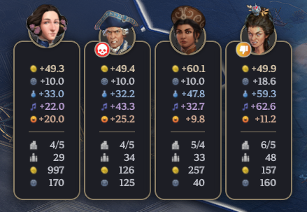

# zhekoff's Enhanced Diplomacy Banners

**zhekoff's Enhanced Diplomacy Banners** is a UI improvement mod that transforms the diplomatic ribbon in Civilization VII. This mod provides a cleaner, more informative, and visually customizable interface for the diplomatic ribbons without affecting gameplay mechanics.

* **Sleek, Compact Design:** Completely redesigned diplomatic banners with a cleaner, more space-efficient layout
* **More Statistics:** View additional metrics including total gold reserves, total influence points, and population counts (configurable to show permanently or on hover)
* **Extensive Customization:**
    * Two relationship icon presets (Classic and Emoji)
    * Five background themes for different visual styles
    * Toggle civilization emblems for additional identity
    * Option to show/hide extended yields until hover
* **Flexible Display Modes:** Choose between always-visible banners or opt for the default Civ VII behavior (hidden until hover)
* **Leader Expression Control:** Option to disable dynamic leader expressions

## Installation

1. Download the latest release.
2. Extract the contents into your `{user}\AppData\Local\Firaxis Games\Sid Meier's Civilization VII\Mods` folder.

## Compatibility

The mod is compatible with Patch 1.1.0. It is fully modularized, so it should not have any conflicts with other mods (unless they also modify the same resources as me).

## Future Plans

* More stat trackers, like Military Strength / Victory Scores.
* More user settings

