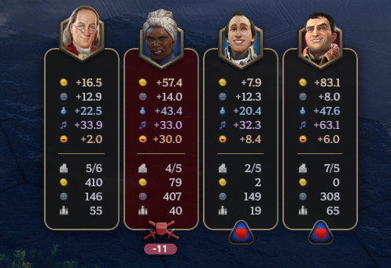

# zhekoff's Enhanced Diplomacy Banners

A Civilization 7 mod that provides a more compact and enhanced UI for diplomacy banners.

* Re-designed diplomatic banners with a focus on achieving a more clean and compact UI
* Customization settings - choose your relationship icon preset, whether to show all additional yields or Civilization banner
* New relationship icons and war support elements (classic and emoji icon presets currently available)
* New stat trackers, that appear on hover - total gold treasury, total influence amount and total population
* Banners are always on (solves a recurring issue with the "Always show yields" toggle)
* Minor UI adjustments

## Installation

1. Download the latest release.
2. Extract the contents into your `{user}\AppData\Local\Firaxis Games\Sid Meier's Civilization VII\Mods` folder.

## Compatibility

The mod is compatible with Patch 1.1.0. It is fully modularized, so it should not have any conflicts with other mods (unless they also modify the same resources as me).

## Future Plans

* More stat trackers, like Military Strength / Victory Scores.
* More user settings

